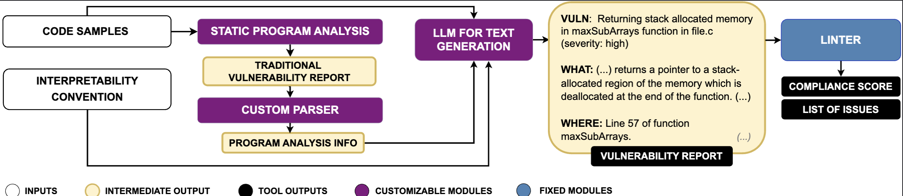

# Replication Package: Interpretable Vulnerability Detection Reports

This repository contains the replication package for our paper on interpretable vulnerability detection reports. It includes all data, code, and analysis scripts needed to reproduce the results presented in the paper.

## Tools Overview
Our framework can be operationalized via [/secgen](/secgen) (which parses static analysis reports and generates improved versions) and [/secgenlint](/secgenlint) (which provides linting capabilities to validate report compliance).




### 1. SecGen
SecGen is a tool and convention for creating structured, interpretable security vulnerability reports. It helps developers and security researchers document vulnerabilities in a standardized and comprehensive format. The tool processes vulnerable code and corresponding security reports, generating new and improved versions of the security information. It contains:

- Vulnerability identification with CWE references
- Detailed vulnerability descriptions and locations
- Impact analysis and exploitation scenarios
- Code flow analysis (sources and sinks)
- Concrete fix suggestions with explanations

Check [SECGen for more details](/secgen/).

### 2. SecGenLint
SecGenLint is the accompanying linting tool that validates security vulnerability reports against the SECGEN convention. It ensures reports are structured, complete, and interpretable by:

- Validating report structure and completeness
- Checking for required sections and tags
- Measuring compliance against interpretability standards
- Providing actionable feedback for improvements

Check [SECGenLint for more details](/secgenlint).

## Project Structure

```
.
├── quantitative-eval/           # Quantitative evaluation data and results
│   ├── 416/                      # Dataset 1 (416 samples)
│   │   ├── 416.csv              # CWE-416 samples
│   │   ├── applicability/       # Applicability results
│   │   ├── compliance/          # Compliance evaluation
│   │   ├── orig_samples/        # Original vulnerable code samples
│   │   ├── patch/               # Generated patches
│   │   └── reports/             # Generated vulnerability reports
│   └── 787/                      # Dataset 2 (787 samples)
│       ├── 787.csv              # CWE-787 samples
│       ├── applicability/       # Applicability results
│       ├── compliance/          # Compliance evaluation
│       ├── orig_samples/        # Original vulnerable code samples
│       ├── patch/               # Generated patches
│       └── reports/             # Generated vulnerability reports
│
├── user-study/                  # Human evaluation study
│   ├── analysis/                # Statistical analysis scripts (R)
│   ├── surveys/                 # Pre-study and post-study surveys
│   └── tasks/                   # User study tasks and results
│
├── secgen/                      # SecGen tool implementation
│   └── secgen/                  # Source code for report generation
│
├── secgenlint/      # Linting tool
│   ├── secgenlint/         # Source code for SecGenLint
│   ├── rules/       # Linting rules definitions
│   └── README.md/       # Documentation
│
└── examples/        # Example files to test the tools
```

## Getting Started

### Prerequisites

1. **Python Environment**
   - Python v3.9.20 (exact version required)
   - pip package manager

2. **Ollama** (for report generation)
   - Required for AI-powered report generation
   - Installation guidelines at [ollama.com](https://ollama.com/)

### Installation

1. **Clone the Repository**
```bash
git clone https://github.com/XXX/interpretable-vulnerability-reports
cd interpretable-vulnerability-reports
```

2. **Install SecGen**
```bash
cd secgen
pip install -r requirements.txt
python setup.py install
```

3. **Install SecGenLint**
```bash
cd ../secgenlint
pip install -r requirements.txt
python setup.py install
```

## Usage

### SecGen

SecGen can be used via command line with the following arguments:

| Argument | Short | Description | Default |
|----------|-------|-------------|---------|
| `--help` | `-h` | Show help message | - |
| `--version` | `-v` | Show version | - |
| `--input-file` | `-in` | Vulnerable program to analyze | Required |
| `--output-file` | `-out` | Output report file | Required |
| `--model` | `-m` | AI model to use | gpt-4o-mini |
| `--report` | `-r` | Path to static analysis report | Required |
| `--quiet` | `-q` | Disable linting | false |

Example usage:
```bash
secgen -in=tool/samples/FormAI_1007.c -r=tool/samples/codeql/results_FormAI_1007.sarif -out=tool/samples/generated/1007.txt --model=smollm:latest 
```
**NOTE**: Download `smollm:latest` (~990MB) in advance (`ollama; ollama pull smollm:latest`).


### SecGenLint

SecGenLint can be used independently to validate existing vulnerability reports:

| Argument | Short | Description | Default |
|----------|-------|-------------|---------|
| `--help` | `-h` | Show help message | - |
| `--version` | `-v` | Show version | - |
| `--input-file` | `-i` | Report file to validate | Required |
| `--output-file` | `-o` | Compliance report output | Required |
| `--show-score` | `-s` | Show compliance score | true |
| `--quiet` | `-q` | Show only errors/warnings | false |

Example usage:
```bash
secgenlint --input-file report.txt --output-file compliance.txt
```

## Report Structure

SecGen generates and SecGenLint validates reports with the following structure:

```
vuln: <vulnerability-name-here-with-CWE-info> in <file-name-and-line-numbers> (severity: <level-here>)

what: <describe the vulnerability>
where: <locate the vulnerability lines and file>
why: <describe one possible consequence of not resolving this weakness>
how: <explain how an attacker would proceed to exploit this vulnerability>

code-sources: <identify entry points in code where user input enters an application>
code-sinks: <identify actions performed by the application, using user input from a source>

suggested-fix: <code diff file showing the necessary code changes to fix the vulnerability>
explanation-suggested-fix: <explain how the suggested code diff resolves the vulnerability>

method: <write CODEQL if there is any taint information; say UNKNOWN otherwise>
```

## License
Licenses can be found [here](/secgen/LICENSE.md) and [here](/secgenlint/LICENSE.md).